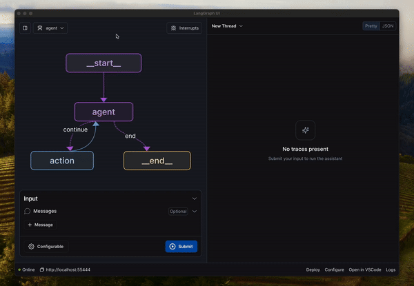
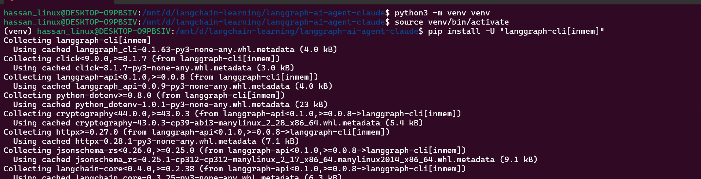
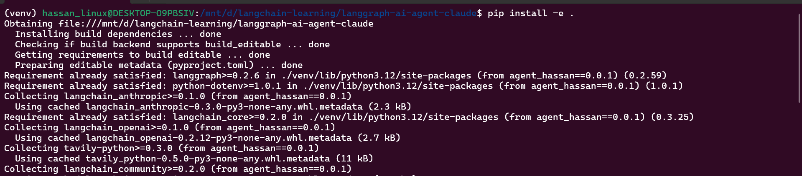
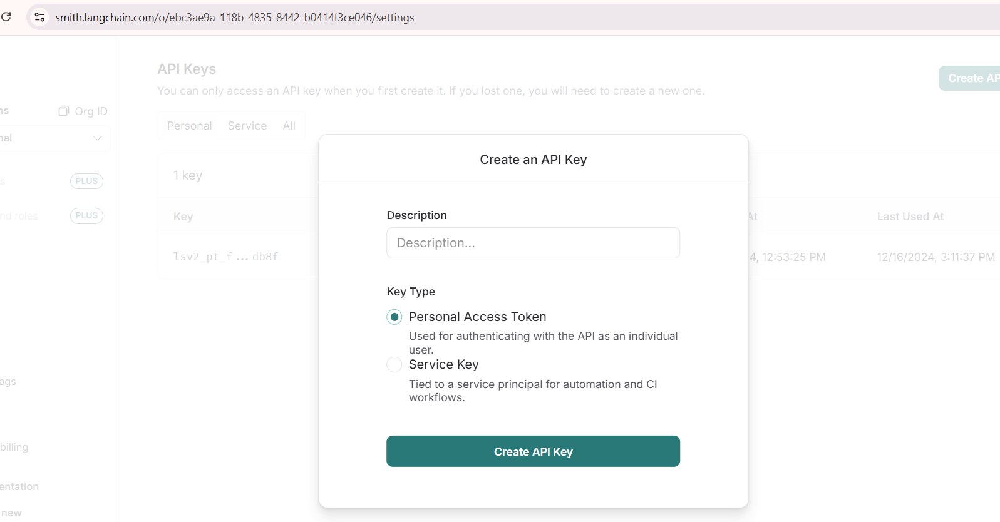
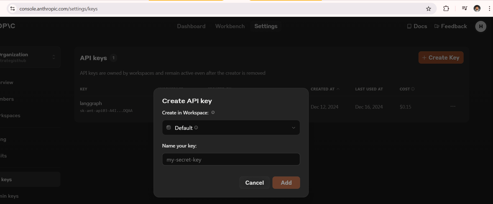
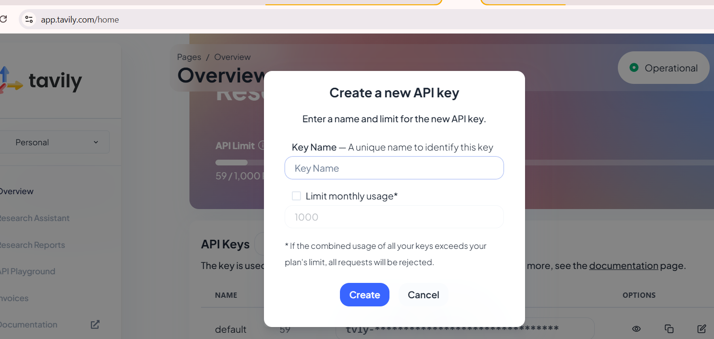
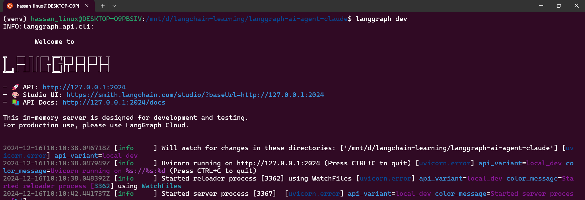
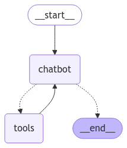

# AI Agent with LangGraph, LangSmith, Claude, and Tavily

This repository demonstrates how to create an AI Agent using [LangGraph](https://langchain-ai.github.io/langgraph/) with [LangSmith](https://www.langchain.com/langsmith), [Claude](https://www.anthropic.com/claude) and [Tavily](https://tavily.com/) to build AI-powered applications using multimodal capabilities. It's designed as a starting point for developers looking to explore and experiment with LangGraph AI Agents.

## 🚀 Features
- **Beginner-friendly**: Simple setup to get started quickly.
- **LLM Integration:** Powered by Claude for advanced reasoning and natural language capabilities.
- **Search Integration:** Employs Tavily as a tool, allowing the agent to query the web, retrieve information, and enhance its knowledge of current events or data outside the training corpus.
- **Extensible:** Easily adapt the agent to incorporate new tools, models, or additional data sources.

---

[](intro.gif)



---

## 🛠️ Setup Instructions

Follow these steps to set up and run the project on your local machine:

### 1. Clone the Repository
```bash
git clone https://github.com/hmshb/langgraph-ai-agent-claude.git
cd langgraph-ai-agent-claude
```

### 2. Create a Virtual Environment
```bash
python -m venv venv
source venv/bin/activate  # For Linux/Mac

.\venv\Scripts\activate # For Windows
```

### 3. Install LangGraph CLI
```bash
pip install -U "langgraph-cli[inmem]"
```



### 4. Install Other Dependencies
```bash
pip install -e .
```



### 5. Generate LangSmith API Key
1. Visit [LangSmith](https://smith.langchain.com/settings).
2. Create an API key for accessing LangSmith logs.
3. Copy the generated API key.



### 5. Generate Anthropic Claude API Key
1. Visit [Anthropic](https://console.anthropic.com/settings/keys).
2. Create an API key for accessing Claude.
3. Copy the generated API key.



### 6. Generate Tavily API Key
1. Visit [Tavily](https://app.tavily.com/home).
2. Create an API key for accessing tavily.
3. Copy the generated API key.



### 7. Update ```.env``` File
 - Add the following line to the .env file for actual keys
    ```
    LANGCHAIN_TRACING_V2=true
    LANGCHAIN_API_KEY=lsv2_pt_*************************
    TAVILY_API_KEY=tvly-*******************************
    ANTHROPIC_API_KEY=sk-ant-**************************
    ```
   
### 8. Run the project
```bash
langgraph dev
```



---

### 9. LangGraph of the AI Agent



---

## 📂 Project Structure
```
langchain-ai-agent-google-gemini/
├── .env                 # API key configuration file
├── agent                # Actual AI Agent lives here
├── langgraph.json       # Configuration file for LangGraph
├── pyproject.toml       # configuration file to defines build system requirements and metadata for Python projects.
├── README.md            # Documentation file
├── venv/                # Virtual environment
```

---

## ⭐ Acknowledgments

Special thanks to:

- **[LangGraph](https://langchain-ai.github.io/langgraph/)** for providing a robust framework for building AI Agents.
- **[LangSmith](https://www.langchain.com/langsmith)** for providing a platform for monitoring, debugging, and evaluating applications built with LangChain
- **[Claude](https://www.anthropic.com/claude)** for their powerful multimodal AI capabilities.
- **[Tavily](https://tavily.com/)** for allowing the agent to query the web.
- **[LangGraph Example](https://langchain-ai.github.io/langgraph/tutorials/introduction/)** official example, inspiration behind my example

---

## 📜 License

This project is open-source and licensed under the [MIT License](LICENSE).

---

## 📢 Get Involved!

If you find this repository helpful, please consider:

- ⭐ **Starring the Repository** to show your support.
- 📤 **Forking the Repository** to explore further and make your own customizations.
- 💬 **Sharing Your Feedback** by opening issues or discussions.

---

## 📝 Notes

 **LangGraph**, **LangSmith**, **Claude** and **Tavily** is currently in limited or preview release (depending on your region and timing), and integration details may change as the service evolves. 
 
Always refer to official documentation for the most up-to-date guidance.

### Let's build amazing AI-powered applications together!